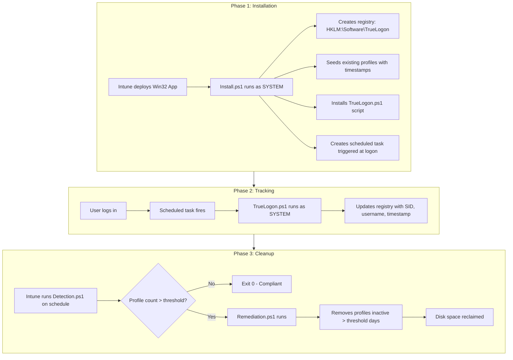

# True Logon


## Overview

True Logon solves a common problem in shared Windows environments: user profiles pile up over time, wasting disk space and slowing down machines. It automatically tracks when users log in and removes profiles that haven't been used in a configurable number of days (default: 90 days).

**Key benefits:**
- Reclaims disk space automatically
- No manual cleanup required
- Preserves active user profiles
- Works silently in the background

---

## Technical Overview

True Logon is a Windows profile management system that tracks user logon activity and automatically removes stale profiles from shared workstations.

### The Problem

Windows machines accumulate user profiles over time. On shared workstations, profiles from former employees, test accounts, and one-time users pile up, consuming disk space and degrading performance. Windows' built-in file timestamps are unreliable for determining when a user last logged in because security tools and background processes frequently modify profile folders.

### The Solution

True Logon records logon timestamps directly to the Windows registry, providing an accurate and tamper-resistant record of when each user last logged in. This data drives automated cleanup that removes profiles that haven't been used in a configurable number of days.

---

## How It Works

True Logon operates in three phases:



### Phase 1: Installation

The Win32 app deploys `Install.ps1` which sets up the tracking infrastructure:

1. Creates the registry key `HKLM:\Software\TrueLogon`
2. Enumerates existing user profiles and seeds them with initial timestamps
3. Writes the logon tracking script to `C:\ProgramData\TrueLogon\TrueLogon.ps1`
4. Registers a scheduled task that runs at every user logon

### Phase 2: Ongoing Tracking

Every time a user logs in, the scheduled task executes and records:

| Registry Value | Description |
|----------------|-------------|
| `LastLogon` | Timestamp in ISO 8601 format |
| `Username` | The user's login name |
| `ProfilePath` | Path to the user's profile folder |

Data is stored under `HKLM:\Software\TrueLogon\{SID}` where `{SID}` is the user's Security Identifier.

### Phase 3: Automated Cleanup

Intune Proactive Remediation runs on a schedule:

1. **Detection** - Counts user profiles on the machine
2. **Decision** - If count exceeds threshold, triggers remediation
3. **Remediation** - Removes profiles that have been inactive beyond the configured days

---

## Customizable Parameters

| Parameter | Location | Default | Description |
|-----------|----------|---------|-------------|
| `ProfileThreshold` | Detection.ps1 (PR) | `30` | Maximum profiles before cleanup triggers |
| `DaysThreshold` | Remediation.ps1 | `90` | Days of inactivity before a profile is removed |
| `ExcludeUsers` | Remediation.ps1 | See script | Usernames to never remove |

### Built-in Exclusions

The following accounts are always protected from removal:
- Default, Default User, Public, All Users
- Administrator
- Currently logged-in users

---

## Repository Structure

```
├── W32App/                           # Win32 app (logon tracking)
│   ├── Install.ps1                   # Installs tracking system
│   └── Detection.ps1                 # Validates installation
├── ProactiveRemediationScripts/      # Proactive Remediation (cleanup)
│   ├── Detection.ps1                 # Checks profile count
│   └── Remediation.ps1               # Removes stale profiles
├── Assets/                           # Images
├── CHANGELOG.md                      # Release history
└── README.md                         # This file
```

---

## Deployment

### Prerequisites

- Windows 10/11 or Windows Server 2016+
- PowerShell 5.1+
- Administrator/SYSTEM privileges
- Microsoft Intune (recommended) or SCCM

### Quick Start

**1. Deploy the Win32 App (True Logon Tracking)**

Package and deploy `W32App/Install.ps1` as an Intune Win32 app. Use `W32App/Detection.ps1` for installation detection.

**2. Deploy the Proactive Remediation (Profile Cleanup)**

Create a Proactive Remediation with:
- Detection: `ProactiveRemediationScripts/Detection.ps1`
- Remediation: `ProactiveRemediationScripts/Remediation.ps1`

### Manual Testing

```powershell
# Install tracking system
.\W32App\Install.ps1

# Simulate cleanup (no changes made)
.\ProactiveRemediationScripts\Remediation.ps1 -WhatIf

# Run cleanup with custom threshold
.\ProactiveRemediationScripts\Remediation.ps1 -DaysThreshold 60
```

---

## Documentation

- [Win32 App Packaging](W32App/README.md)
- [Proactive Remediation Setup](ProactiveRemediationScripts/README.md)
- [Changelog](CHANGELOG.md)

---

## License

MIT License. See [LICENSE](LICENSE).
