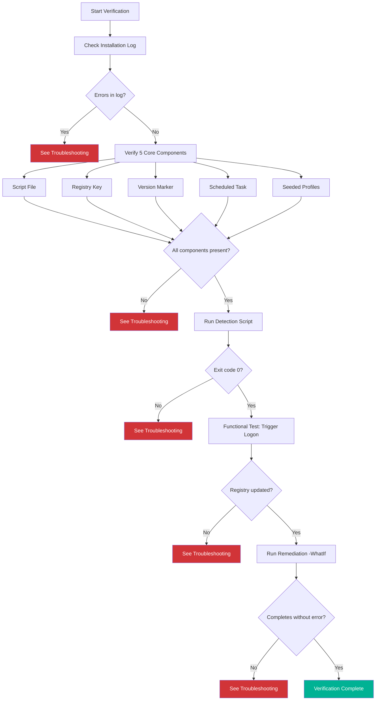

# True Logon - Installation Verification Checklist

This checklist helps engineers verify that True Logon is installed correctly and functioning as intended.

---

## Verification Flow



---

## 1. Check Installation Log

Review the installation log for any errors.

**Log location:**
```
C:\ProgramData\TrueLogon\Logs\TrueLogon-Install.log
```

**Open with CMTrace for color-coded viewing:**
```powershell
# If CMTrace is available
CMTrace.exe "C:\ProgramData\TrueLogon\Logs\TrueLogon-Install.log"

# Or view recent entries in PowerShell
Get-Content "C:\ProgramData\TrueLogon\Logs\TrueLogon-Install.log" -Tail 20
```

| Status | What to Look For |
|--------|------------------|
| ✅ Pass | Log ends with "installation completed successfully" |
| ❌ Fail | Any lines containing `type="3"` (errors in CMTrace format) |

---

## 2. Verify Core Components

True Logon has 5 required components. Verify each one:

### 2.1 Script File

```powershell
Test-Path "C:\ProgramData\TrueLogon\TrueLogon.ps1"
```

| Output | Status |
|--------|--------|
| `True` | ✅ Pass |
| `False` | ❌ Fail - Script file missing |

---

### 2.2 Registry Key

```powershell
Test-Path "HKLM:\Software\TrueLogon"
```

| Output | Status |
|--------|--------|
| `True` | ✅ Pass |
| `False` | ❌ Fail - Registry key missing |

---

### 2.3 Version Marker

```powershell
(Get-ItemProperty "HKLM:\Software\TrueLogon" -ErrorAction SilentlyContinue).Version
```

**Expected output:**
```
1.0.0
```

| Output | Status |
|--------|--------|
| `1.0.0` (or any version) | ✅ Pass |
| Empty or error | ❌ Fail - Version not set |

---

### 2.4 Scheduled Task

```powershell
Get-ScheduledTask -TaskName "TrueLogon" | Select-Object TaskName, State
```

**Expected output:**
```
TaskName  State
--------  -----
TrueLogon Ready
```

| State | Status |
|-------|--------|
| `Ready` | ✅ Pass |
| `Running` | ✅ Pass (task currently executing) |
| `Disabled` | ❌ Fail - Task is disabled |
| Error: "No matching task" | ❌ Fail - Task not created |

**Verify task trigger:**
```powershell
Get-ScheduledTask -TaskName "TrueLogon" | Get-ScheduledTaskInfo
(Get-ScheduledTask -TaskName "TrueLogon").Triggers | Format-List
```

| Check | Expected |
|-------|----------|
| Trigger type | `AtLogon` |

---

### 2.5 Seeded Profiles

```powershell
$profiles = Get-ChildItem "HKLM:\Software\TrueLogon" | Where-Object { $_.PSChildName -match '^S-1-5-21-' }
Write-Output "Seeded profiles: $($profiles.Count)"
$profiles | ForEach-Object {
    $props = Get-ItemProperty $_.PSPath
    [PSCustomObject]@{
        Username = $props.Username
        LastLogon = $props.LastLogon
    }
} | Format-Table
```

**Expected output (example):**
```
Seeded profiles: 3

Username      LastLogon
--------      ---------
jwalderbach   2026-01-23T09:15:00
testuser      2026-01-22T14:30:00
admin.local   2026-01-20T08:00:00
```

| Profile Count | Status |
|---------------|--------|
| ≥ 1 | ✅ Pass |
| 0 | ⚠️ Warning - No profiles seeded (may be expected on fresh install) |

---

## 3. Run Detection Script (All-in-One Validator)

The detection script validates all 5 components in one step.

```powershell
& ".\W32App\Detection.ps1"
echo "Exit code: $LASTEXITCODE"
```

**Expected output:**
```
True Logon system is fully compliant - all components present
Exit code: 0
```

| Exit Code | Output | Status |
|-----------|--------|--------|
| `0` | "fully compliant" | ✅ Pass |
| `1` | Lists failed components | ❌ Fail - See output for details |
| `2` | Critical error | ❌ Fail - Check detection log |

**Detection log location:**
```
C:\ProgramData\TrueLogon\Logs\TrueLogon-Detection.log
```

---

## 4. Functional Test: Verify Tracking Works

This confirms the scheduled task fires and updates the registry on logon.

### Step 1: Note Current State

```powershell
# Pick a user SID to monitor (or use your own)
$testSID = (Get-ChildItem "HKLM:\Software\TrueLogon" | Where-Object { $_.PSChildName -match '^S-1-5-21-' } | Select-Object -First 1).PSChildName
$before = (Get-ItemProperty "HKLM:\Software\TrueLogon\$testSID").LastLogon
Write-Output "User SID: $testSID"
Write-Output "LastLogon before: $before"
```

### Step 2: Trigger a Logon Event

**Option A:** Log off and log back on as the test user

**Option B:** Manually run the tracking script (simulates logon):
```powershell
& "C:\ProgramData\TrueLogon\TrueLogon.ps1"
```

### Step 3: Verify Registry Updated

```powershell
$after = (Get-ItemProperty "HKLM:\Software\TrueLogon\$testSID").LastLogon
Write-Output "LastLogon after: $after"
```

| Result | Status |
|--------|--------|
| Timestamp changed to current time | ✅ Pass |
| Timestamp unchanged | ❌ Fail - Tracking not working |

### Step 4: Check Tracking Log

```powershell
Get-Content "C:\ProgramData\TrueLogon\Logs\TrueLogon-Tracking.log" -Tail 5
```

| Result | Status |
|--------|--------|
| Recent entry with current timestamp | ✅ Pass |
| No recent entries | ❌ Fail - Script not logging |

---

## 5. Verify Remediation Ready

Run the remediation script in simulation mode to confirm it can read the tracking data.

```powershell
& ".\ProactiveRemediationScripts\Remediation.ps1" -WhatIf
```

**Expected output (example):**
```
Scanning for profiles inactive since: 2025-10-25 12:00:00 [WHATIF MODE]
Threshold: 90 days

-----------------------------------------------------
Username:       olduser
Last Logon:     2025-08-15 10:30:00
Days Inactive:  161.2 days
Profile Path:   C:\Users\olduser
Disk Usage:     1.23 GB
Action:         [SIMULATION] Would delete profile
Status:         SUCCESS - Removed: User account (simulated), User profile (simulated), Registry entry (simulated)

========================================
CLEANUP SUMMARY [WHATIF MODE]
========================================
Total Users Scanned:        5
Stale Profiles Found:       1
Disk Space Reclaimed:       1.23 GB
Days Threshold:             90 days
========================================
```

| Result | Status |
|--------|--------|
| Script completes, shows scan results | ✅ Pass |
| "Registry path not found" error | ❌ Fail - True Logon not installed |
| Other errors | ❌ Fail - Check remediation log |

**Remediation log location:**
```
C:\ProgramData\TrueLogon\Logs\TrueLogon-Remediation.log
```

---

## 6. Quick Verification Summary

Run this single block to check all components at once:

```powershell
Write-Host "`n=== True Logon Verification ===" -ForegroundColor Cyan

# Script file
$script = Test-Path "C:\ProgramData\TrueLogon\TrueLogon.ps1"
Write-Host "Script file:     " -NoNewline
if ($script) { Write-Host "PASS" -ForegroundColor Green } else { Write-Host "FAIL" -ForegroundColor Red }

# Registry key
$regKey = Test-Path "HKLM:\Software\TrueLogon"
Write-Host "Registry key:    " -NoNewline
if ($regKey) { Write-Host "PASS" -ForegroundColor Green } else { Write-Host "FAIL" -ForegroundColor Red }

# Version
$version = (Get-ItemProperty "HKLM:\Software\TrueLogon" -ErrorAction SilentlyContinue).Version
Write-Host "Version marker:  " -NoNewline
if ($version) { Write-Host "PASS ($version)" -ForegroundColor Green } else { Write-Host "FAIL" -ForegroundColor Red }

# Scheduled task
$task = Get-ScheduledTask -TaskName "TrueLogon" -ErrorAction SilentlyContinue
Write-Host "Scheduled task:  " -NoNewline
if ($task -and $task.State -in @('Ready','Running')) { Write-Host "PASS ($($task.State))" -ForegroundColor Green }
elseif ($task) { Write-Host "WARN ($($task.State))" -ForegroundColor Yellow }
else { Write-Host "FAIL" -ForegroundColor Red }

# Seeded profiles
$profiles = (Get-ChildItem "HKLM:\Software\TrueLogon" -ErrorAction SilentlyContinue | Where-Object { $_.PSChildName -match '^S-1-5-21-' }).Count
Write-Host "Seeded profiles: " -NoNewline
if ($profiles -gt 0) { Write-Host "PASS ($profiles profiles)" -ForegroundColor Green } else { Write-Host "WARN (0 profiles)" -ForegroundColor Yellow }

Write-Host "================================`n" -ForegroundColor Cyan
```

**Expected output:**
```
=== True Logon Verification ===
Script file:     PASS
Registry key:    PASS
Version marker:  PASS (1.0.0)
Scheduled task:  PASS (Ready)
Seeded profiles: PASS (3 profiles)
================================
```

---

## Troubleshooting

```mermaid
flowchart TD
    subgraph issue1 [Script File Missing]
        A1[Script file not found] --> A2[Check installation log for errors]
        A2 --> A3[Re-run Install.ps1]
    end

    subgraph issue2 [Registry Key Missing]
        B1[Registry key not found] --> B2[Installation failed or was blocked]
        B2 --> B3[Check for Group Policy restrictions]
        B3 --> B4[Re-run Install.ps1 as SYSTEM]
    end

    subgraph issue3 [Scheduled Task Issues]
        C1[Task not found] --> C2[Check installation log]
        C1b[Task disabled] --> C3[Enable task manually or re-install]
        C2 --> C4[Re-run Install.ps1]
    end

    subgraph issue4 [Tracking Not Working]
        D1[Registry not updating on logon] --> D2[Check task is triggering]
        D2 --> D3[Check TrueLogon-Tracking.log]
        D3 --> D4[Run TrueLogon.ps1 manually to test]
    end

    subgraph issue5 [Remediation Fails]
        E1[Remediation script errors] --> E2[Check registry path exists]
        E2 --> E3[Check TrueLogon-Remediation.log]
        E3 --> E4[Verify running as Administrator]
    end
```



### Common Issues

| Symptom | Likely Cause | Solution |
|---------|--------------|----------|
| Script file missing | Installation interrupted | Re-run `Install.ps1` |
| Registry key missing | Insufficient permissions | Run as SYSTEM or Administrator |
| Task state is "Disabled" | Group Policy or manual change | Enable task or check GP settings |
| No profiles seeded | No existing user profiles on machine | Expected on fresh install; profiles seed on first logon |
| Tracking log empty | Task not firing | Verify task trigger is `AtLogon`; check Task Scheduler history |
| Remediation can't find registry | True Logon not installed | Install Win32 app first |
| "Access denied" errors | Not running as Administrator | Run PowerShell as Administrator |

### Log File Reference

| Log File | Location | Contents |
|----------|----------|----------|
| Installation | `C:\ProgramData\TrueLogon\Logs\TrueLogon-Install.log` | Install/uninstall operations |
| Detection | `C:\ProgramData\TrueLogon\Logs\TrueLogon-Detection.log` | Component validation checks |
| Tracking | `C:\ProgramData\TrueLogon\Logs\TrueLogon-Tracking.log` | User logon events |
| Remediation | `C:\ProgramData\TrueLogon\Logs\TrueLogon-Remediation.log` | Profile cleanup operations |

**Tip:** All logs are in CMTrace format. Open with `CMTrace.exe` or `OneTrace` for color-coded severity levels (Info=green, Warning=yellow, Error=red).

---

## Verification Complete Checklist

- [ ] Installation log shows no errors
- [ ] Script file exists at `C:\ProgramData\TrueLogon\TrueLogon.ps1`
- [ ] Registry key exists at `HKLM:\Software\TrueLogon`
- [ ] Version marker is set
- [ ] Scheduled task "TrueLogon" is Ready
- [ ] Existing profiles are seeded in registry
- [ ] Detection script returns exit code 0
- [ ] Tracking updates registry on logon
- [ ] Remediation script runs successfully in WhatIf mode
